<p align="center">
  
</p>

<h1 align="center">ERoute</h1>
<p align="center"><strong>긴급한 순간, 필요한 정보와 가까운 병원을 한곳에서.</strong></p>
<p align="center">주변 응급의료기관 검색 · 병원 상세 정보 · 응급처치 가이드 · 내 응급정보</p>
<p align="center">Flutter / Android · iOS &nbsp; | &nbsp; Spring Boot / Java 21 &nbsp; | &nbsp; PostgreSQL / NMC OpenAPI</p>

ERoute는 **주변 병원을 찾고, 병원 정보를 확인하고, 나의 응급정보를 준비하는** 모바일 앱입니다. 국립중앙의료원(NMC)의 응급의료기관·병상·진료정보를 지도와 목록으로 연결하고, 첫 화면에서 119 신고와 응급상황 안내에 접근할 수 있도록 구성했습니다.

<table>
  <tr><th width="33%">도움이 필요할 때</th><th width="33%">가까운 병원 찾기</th><th width="33%">응급처치 가이드</th></tr>
  <tr>
    <td align="center">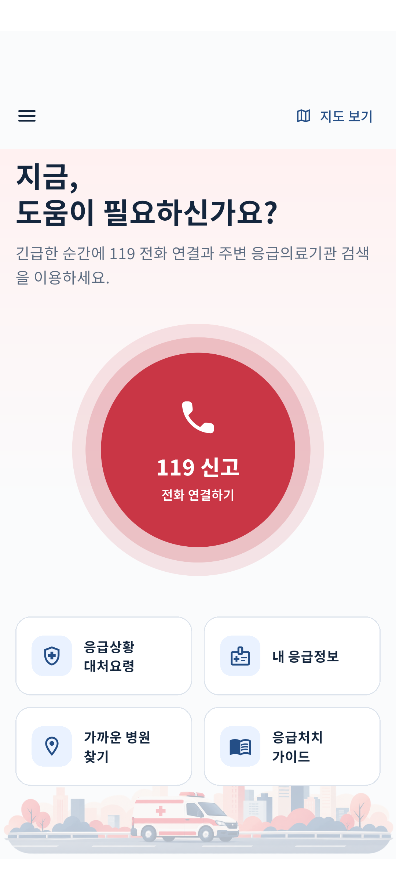</td>
    <td align="center">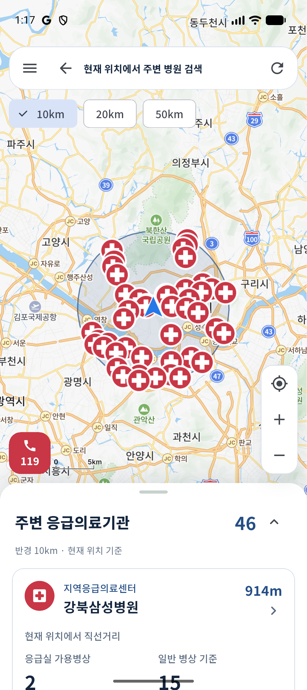</td>
    <td align="center">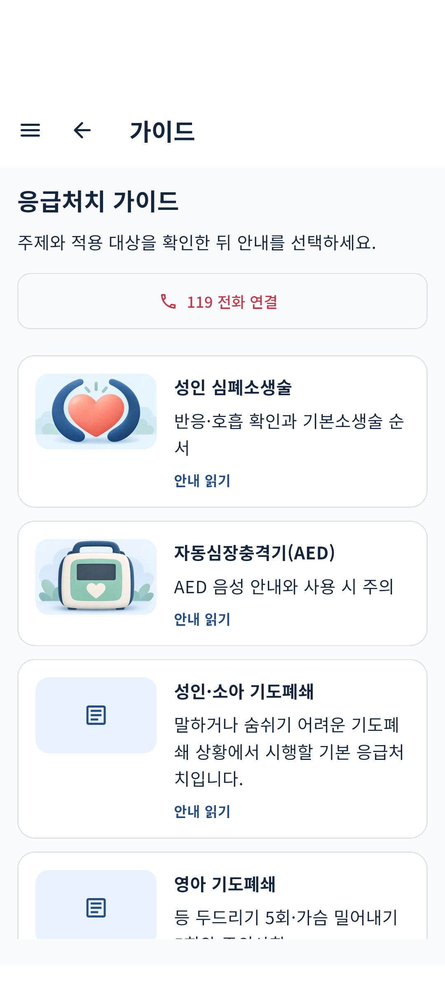</td>
  </tr>
  <tr><td align="center">119와 주요 기능을 첫 화면에</td><td align="center">검색 반경 · 병원 위치 · 거리 확인</td><td align="center">주제와 적용 대상을 보고 안내 선택</td></tr>
</table>

화면은 **2026년 9월 개발·QA 과정에서 촬영한 캡처**입니다. 병원 수·병상·진료시간은 촬영 당시 값이며, 건강정보 화면은 합성 테스트 데이터를 사용합니다. 지도 대표 화면은 마커 군집화 적용 전 캡처입니다. [화면별 출처와 검토 범위](docs/screenshots/README.md)

[주요 기능](#주요-기능) · [화면과 사용 흐름](#화면과-사용-흐름) · [기술 구조](#기술-구조) · [실행과 검증](#실행과-검증) · [개발 문서](docs/development.md)

## 주요 기능

| 기능 | 할 수 있는 일 |
|---|---|
| 주변 응급의료기관 검색 | 현재 위치 또는 수동 검색 중심으로 10·20·50km 반경 조회, 지도와 목록 탐색 |
| 지도 탐색 | 검색 반경 표시, 병원 선택, 확대·축소, 현재 위치 이동, 밀집한 마커 군집화 |
| 병원 상세 | 기관 분류·주소·전화, 응급실 가용병상, 정보 출처·갱신 상태, 진료과목·병원 진료시간 확인 |
| 응급상황 안내 | 응급상황 대처요령과 응급처치 가이드를 주제별로 탐색하고 단계·출처 확인 |
| 내 응급정보 | 로그인과 별도 건강정보 동의 후 알레르기·기저질환·복용약·응급 메모 저장·수정·삭제 |
| 119 문자 준비 | 로그인·동의 상태를 확인하고 포함할 정보를 선택한 뒤 OS 문자 작성 화면으로 전달 |
| 화면 설정 | 라이트·다크 테마와 시스템 글자 크기에 대응 |

**개발 중인 기능도 구분합니다.** 질환과 관련 진료과를 연결하는 개인화 표시는 개발 미리보기이며 운영 공개는 꺼져 있습니다. 식약처 의약품 검색, 공유·즐겨찾기는 준비 중이고, 복용약은 직접 입력해 저장할 수 있습니다.

## 화면과 사용 흐름

### 1. 병원을 찾고, 방문에 필요한 정보를 확인합니다

지도나 목록에서 병원을 선택하면 상세 화면으로 이어집니다. 병상 수치 옆에 출처와 갱신 상태를 표시하고, **정보 미제공을 0병상과 구분**합니다. 진료정보에서는 진료과목과 요일별 병원 진료시간을 확인할 수 있습니다.

<table>
  <tr><th width="50%">병원 상세 · 정보 상태</th><th width="50%">진료과목 · 병원 진료시간</th></tr>
  <tr>
    <td align="center">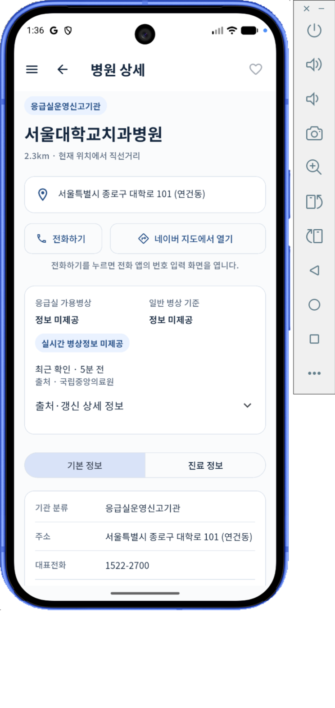</td>
    <td align="center">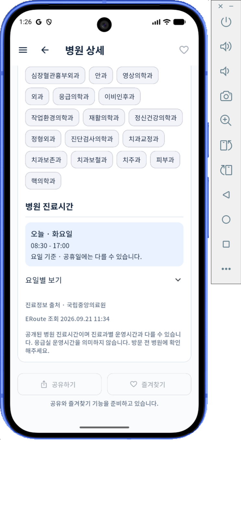</td>
  </tr>
</table>

병상 정보와 진료시간은 현재 진료·수용 가능을 보장하지 않습니다. 병원 진료시간과 응급실 운영시간도 구분해 안내합니다.

### 2. 나의 응급정보를 미리 정리합니다

알레르기, 기저질환, 복용약, 응급 메모를 한 화면에서 확인합니다. **미입력·명시적 없음·등록됨**을 구분하고, 사용자가 항목을 수정하거나 동의를 철회할 수 있도록 구성했습니다.

<table>
  <tr><th width="50%">내 응급정보 · 라이트</th><th width="50%">내 응급정보 · 다크</th></tr>
  <tr>
    <td align="center">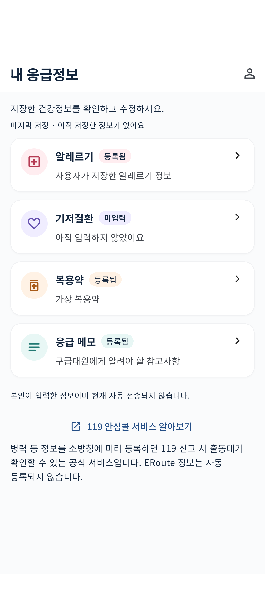</td>
    <td align="center">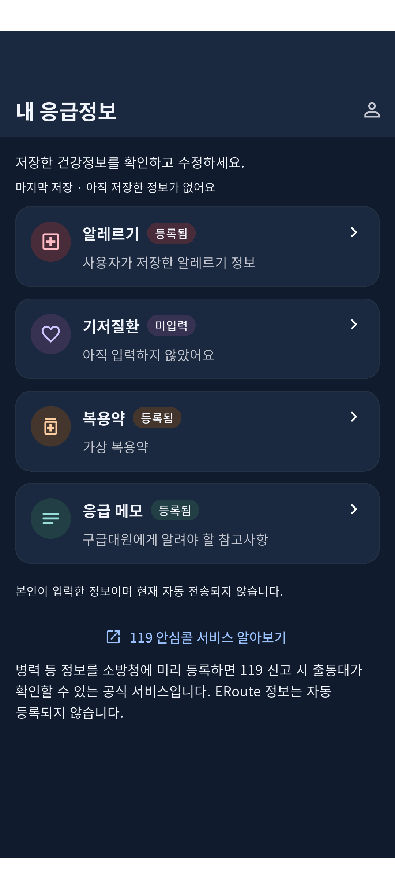</td>
  </tr>
</table>

119 문자 준비에서는 포함할 항목과 본문을 확인한 뒤 문자 앱으로 이동합니다. **최종 전송은 사용자가 수행**하며, 응급정보가 자동 전송되거나 119 안심콜에 자동 등록되지는 않습니다. [문자 준비 흐름과 구현](docs/operations/emergency-sms-v1.md)

### 3. 필요한 안내를 읽기 쉽게 제공합니다

응급처치 가이드는 주제·적용 대상·단계·출처로 구성하고, 안내를 읽는 중에도 119 연결에 접근할 수 있게 했습니다. Android와 iOS 화면, 다크 테마, 작은 화면과 큰 글자 조합을 QA했습니다.

<table>
  <tr><th width="33%">가이드 상세</th><th width="33%">다크 · 글자 200%</th><th width="33%">iOS 홈</th></tr>
  <tr>
    <td align="center">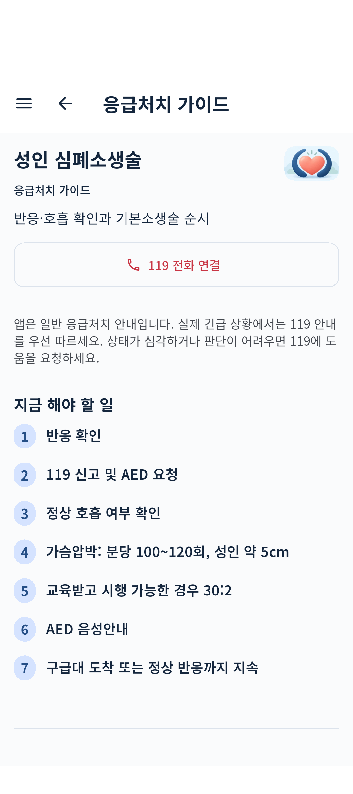</td>
    <td align="center">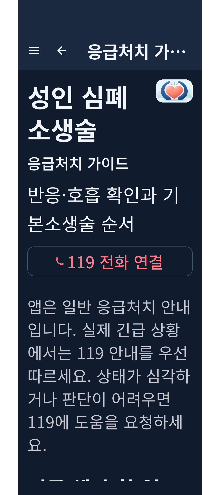</td>
    <td align="center">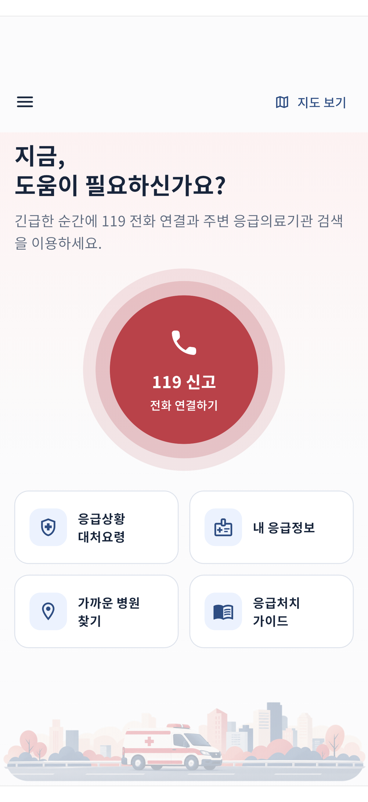</td>
  </tr>
</table>

개발·QA 빌드의 119 전화는 모의 동작으로 검증합니다. 실제 긴급전화 발신이나 문자 전송으로 테스트하지 않습니다. iOS Simulator 화면 검증과 물리 iPhone의 문자 작성 검증은 별개이며, 후자는 아직 수행하지 않았습니다.

## 기술 구조

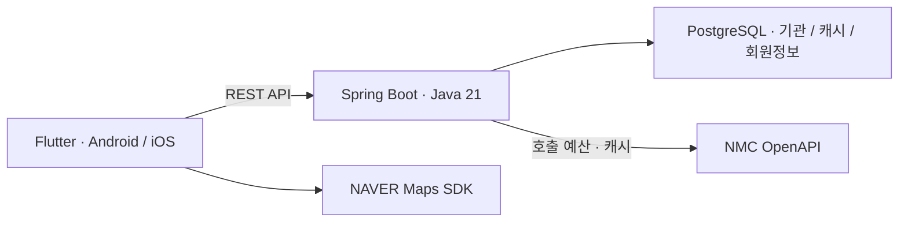

| 영역 | 구성 |
|---|---|
| Mobile | Flutter, Riverpod, Dio, NAVER Maps SDK, Noto Sans KR |
| Backend | Spring Boot 4.1.1, Java 21, Spring Security, JDBC |
| Data | PostgreSQL 16, Flyway, NMC 기관·병상·진료정보 |
| Contract & QA | OpenAPI 계약, Flutter 단위·위젯·통합 테스트, Maven, Testcontainers |

데이터는 다음 원칙으로 다룹니다.

- **기관 목록 보존:** 병원 Master를 기준으로 데이터를 합쳐, 실시간 응답이 없다는 이유만으로 병원을 숨기지 않습니다.
- **상태와 시각 구분:** 0, 미제공, API 오류, 호출 예산 보류를 구분하고 원천 시각과 서버 수집 시각을 분리합니다.
- **호출량 관리:** 300초 공유 캐시와 요청 시 갱신을 사용하며, endpoint별 최근 24시간 자동 호출 예산을 관리합니다.
- **조회와 수집 분리:** 저장된 진료정보를 읽는 상세 조회·탭 전환은 NMC를 추가 호출하지 않습니다.

```text
apps/mobile/        Flutter 앱 · Android / iOS
services/backend/  Spring Boot API · 인증 · 데이터 수집
contracts/         REST 계약 · 테스트 fixture
scripts/           실행 · 원천 검증 · 수집 · 공개 전 검사
infra/             Docker Compose
docs/              설계 · 운영 · API 근거 · 공개 스크린샷
```

## 실행과 검증

필요 도구는 **Flutter 3.47.2, Java 21, PostgreSQL 16, Python 3.9+**입니다. NMC 서비스 키와 네이버 지도 Client ID는 각자 발급받아 로컬에 설정합니다.

1. `.env.example`을 `.env`로 복사하고 DB·API·지도 설정을 입력합니다.
2. Backend를 빌드하고 실행합니다. 최초 기관 수집은 discovery 검증 후 진행합니다.
3. Flutter 의존성을 설치하고 앱을 실행합니다.

```sh
# 저장소 루트에서 Backend 빌드 · 실행
cd services/backend
./mvnw -DskipTests package
cd ../..
python3 scripts/run_backend.py

# 별도 터미널에서 Android 에뮬레이터용 앱 실행
cd apps/mobile
flutter pub get
cd ../..
API_BASE_URL=http://10.0.2.2:18081 python3 scripts/run_mobile.py
```

최초 DB·데이터 수집, 회원 인증, iOS 도구, Docker 실행과 테스트 명령은 **[개발 · 실행 가이드](docs/development.md)**에 정리했습니다. 인증 기본값은 비활성화이며, 회원 기능에는 별도 설정이 필요합니다.

## 더 자세히 보기

| 문서 | 내용 |
|---|---|
| [개발 · 실행 가이드](docs/development.md) | 로컬 설정, 최초 수집, 앱 실행, 테스트, 에뮬레이터 업데이트 |
| [시스템 설계](docs/architecture/emergency-map-v0.1.md) | 데이터 모델과 응급의료기관 조회 구조 |
| [REST API 계약](contracts/openapi/emergency-map-v1.yaml) | 앱과 서버가 사용하는 API |
| [NMC 데이터 설계](docs/api/NMC_API_Data_Design_v0.2.md) | 공식 필드 의미와 실측 근거 |
| [인증 · 건강정보](docs/auth/authentication-and-health.md) | 회원 인증, 동의, 데이터 보호와 운영 |
| [운영 가이드](docs/operations/runbook.md) | 수집, 갱신, 호출 예산과 장애 대응 |
| [공개 자료 관리](docs/operations/github-publication.md) | 비밀정보 검사와 Git 포함·제외 정책 |

공개 스크린샷은 검토한 사본만 `docs/screenshots/`에 포함합니다. 실제 계정의 QA 원본, `.env`, 인증키, 로컬 DB는 저장소에 포함하지 않습니다.
